# ai-weekend-2026-01
Photos and general information about the **AI Weekend** event, held in São Paulo-SP.

Date: **31/01/2026 (Saturday)**

Organizers:
- **Renato Groffe (Microsoft MVP, Docker Captain, Grafana Champion, APIsec U Ambassador, MTAC)**
- **Milton Camara Gomes (Microsoft MVP, MTAC)**
- **Atila Olivi (SENAI)**
- **Carlos Machel (AzureBrasil.cloud)**

Number of participants: **45 people**

---

Presentations/talks that took place during the event:

_# Creating Workflow with Multi-Agents with Microsoft Agent Framework_

Speaker: **Carlos Machel (AzureBrasil.cloud)**

Technologies and topics covered: **Artificial Intelligence, LLMs, AI Agents, Microsoft Agent Framework, .NET, C#, Microsoft Foundry, MCP, Microsoft Azure...**

_# Productivity in Development with AI: Simplifying everyday tasks with MCP Servers_

Speaker: **Renato Groffe (Microsoft MVP, Docker Captain, Grafana Champion, APIsec U Ambassador, MTAC)**

Technologies and topics covered: **Artificial Intelligence, LLMs, MCP, AI Agents, Containers, Visual Studio Code, GitHub Copilot, .NET, Docker, NuGet, npm, Grafana k6, Docker MCP Catalog, Azure API Management, Microsoft Agent Framework, APIsec MCP Audit, GitHub Actions, Azure DevOps, PostgreSQL...**

_# From Documentation to Copilot: Transforming Internal Knowledge into Intelligent Responses_

Speaker: **Milton Camara Gomes (Microsoft MVP, MTAC)**

Technologies and topics covered: **Artificial Intelligence, LLMs, MCP, AI Agents, .NET, C#, Microsoft Azure, Microsoft Copilot 365...**

_# Panel: Application Development x AI Usage -> Pros and Cons_

Participants:
- **Renato Groffe (Microsoft MVP, Docker Captain, Grafana Champion, APIsec U Ambassador, MTAC)**
- **Milton Camara Gomes (Microsoft MVP, MTAC)**
- **Angelo Belchior (Microsoft MVP, APIsec U Ambassador, MTAC)**
- **Carlos Machel (AzureBrasil.cloud)**
- **Lucas Massena (Cloud Solutions Architect)**

Technologies and topics covered: **Artificial Intelligence, LLMs, MCP, AI Agents, GitHub Copilot, Software Engineering, Software Architecture, Microsoft Foundry, Development Best Practices...**

---

Access this [**link**](/img/) to view all photos from the presentations.

This event was a partnership between the communities [**.NET SP**](https://www.meetup.com/dotnet-Sao-Paulo/), [**Azure na Prática**](https://www.youtube.com/azurenapratica) and the [**Escola Senai Suíço-Brasileira Paulo Ernesto Tolle**](https://suicobrasileira.sp.senai.br/).

Registration form used: [**Sympla**](https://www.sympla.com.br/evento/ai-weekend-inteligencia-artificial-agents-mcp-gratuito-e-presencial-sao-paulo-sp/3277678)

Location: **Escola SENAI Suíço-Brasileira Paulo Ernesto Tolle - Rua Bento Branco de Andrade Filho, 379 - Santo Amaro - São Paulo/SP - CEP 04757-000**

---

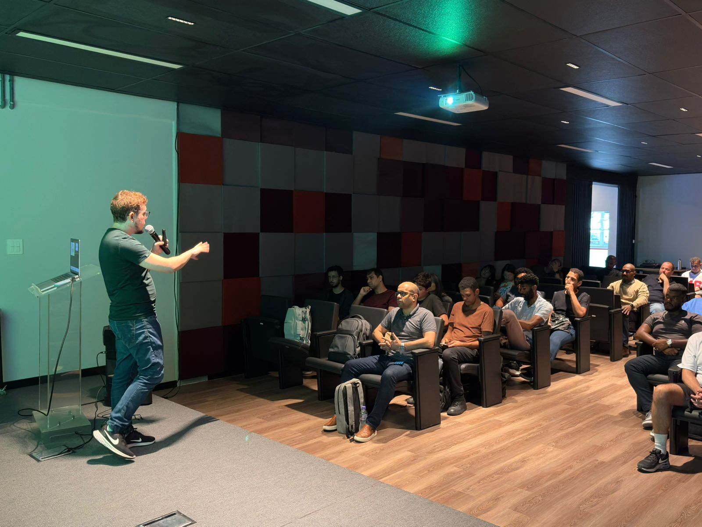

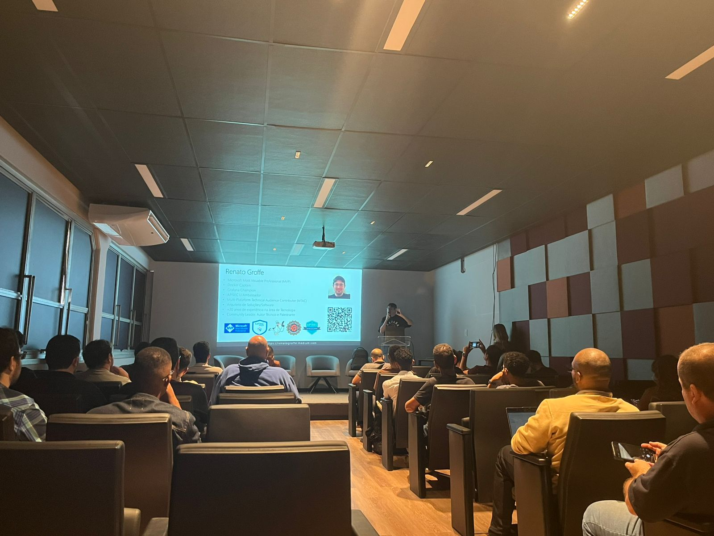

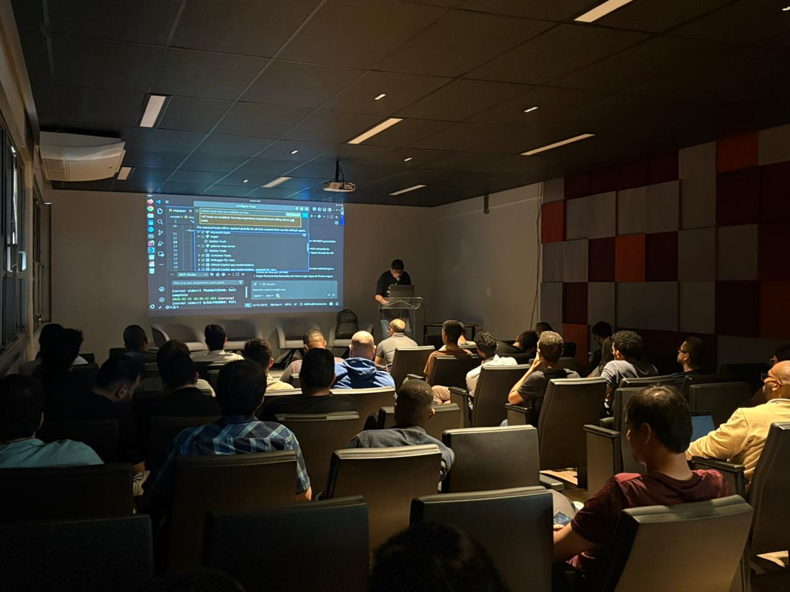

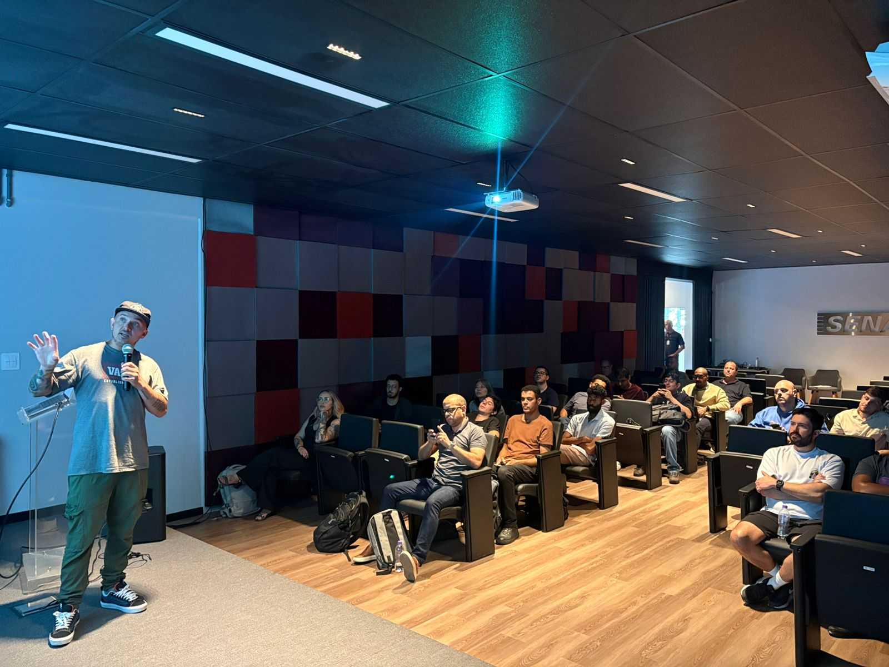

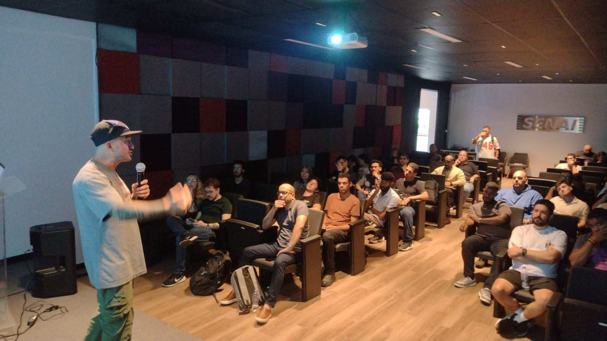

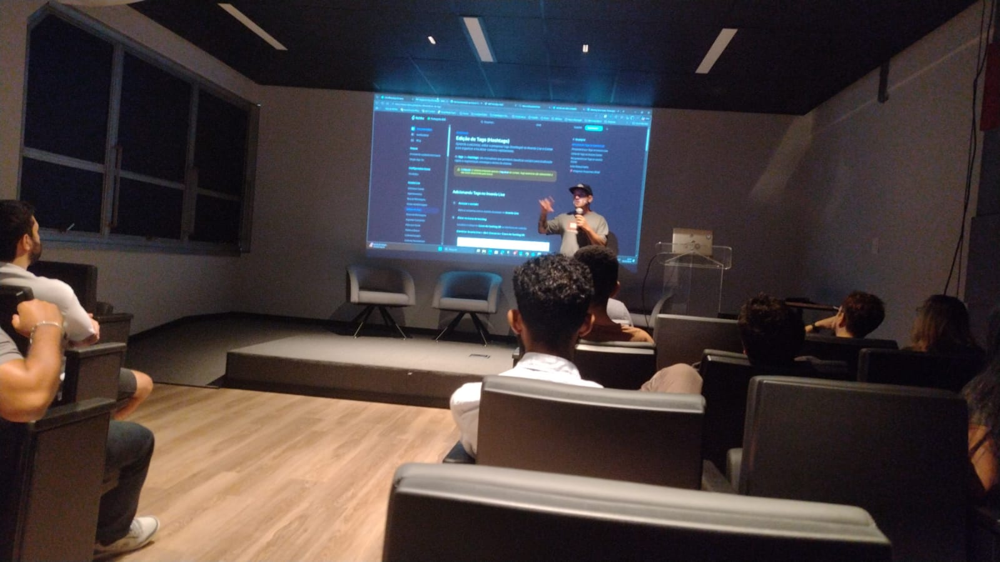

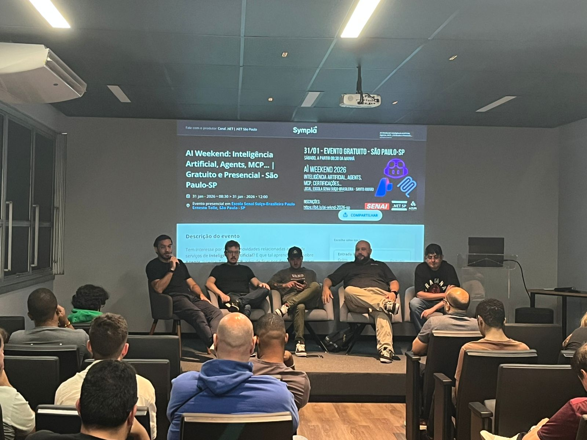

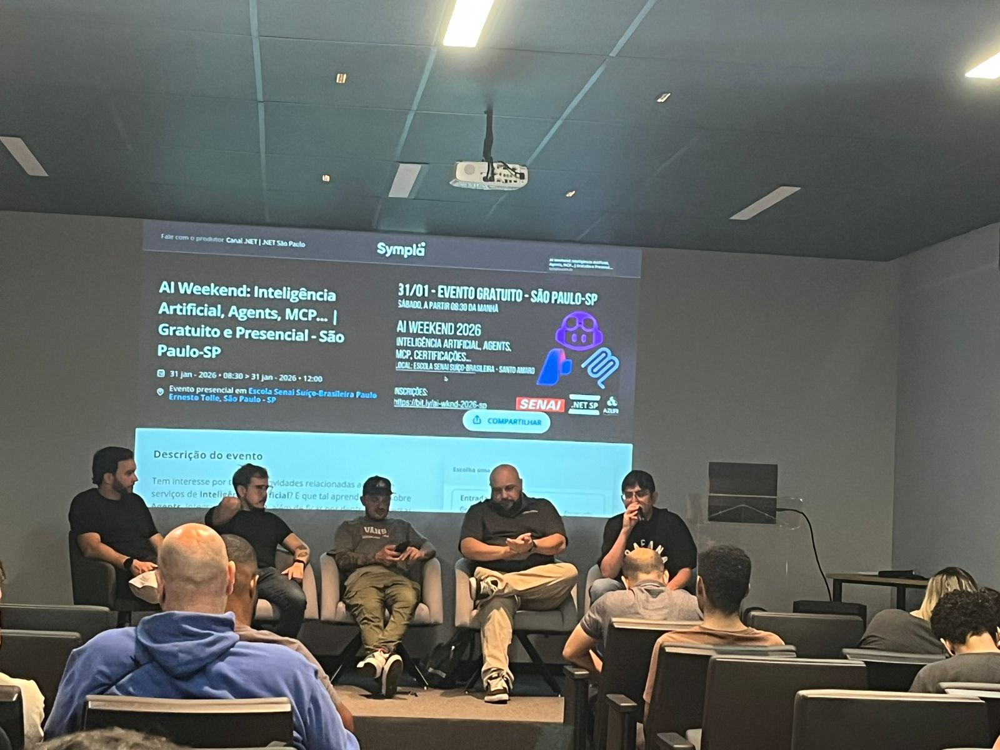

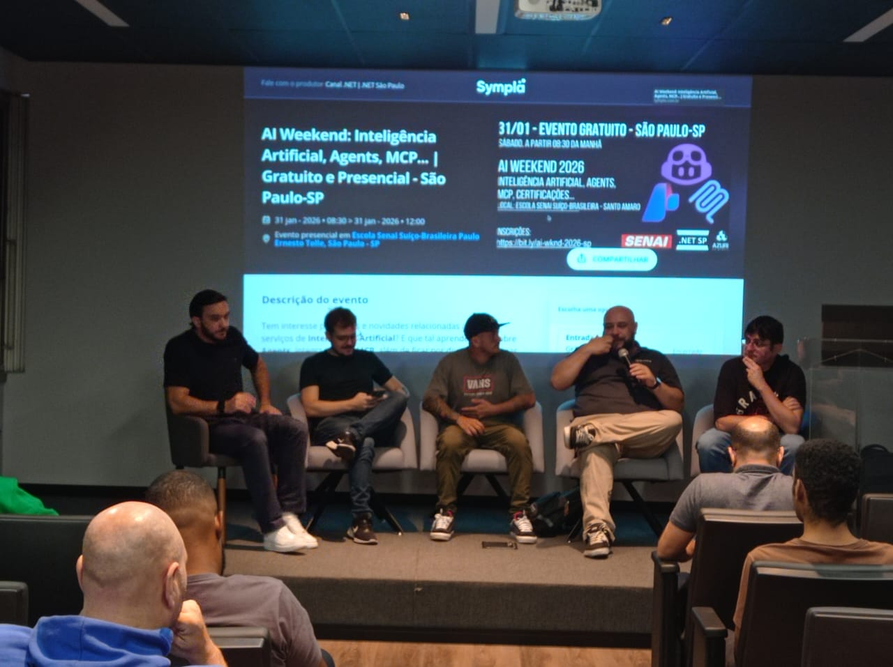

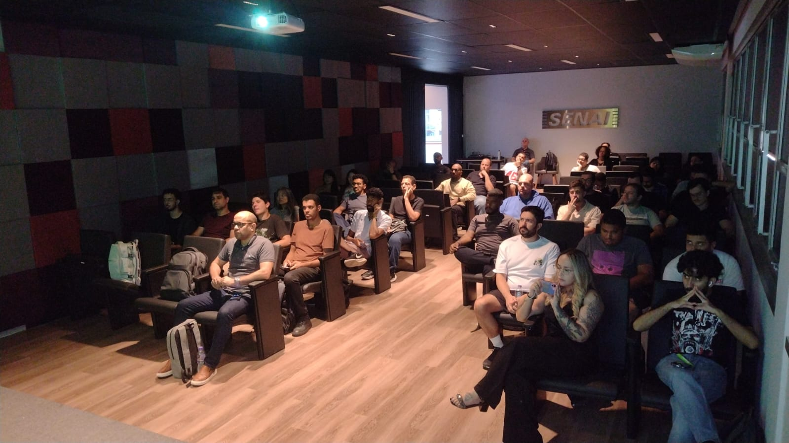

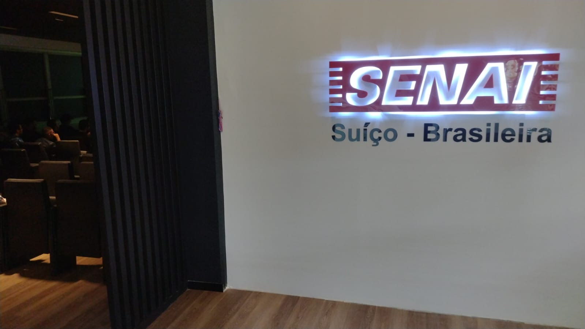

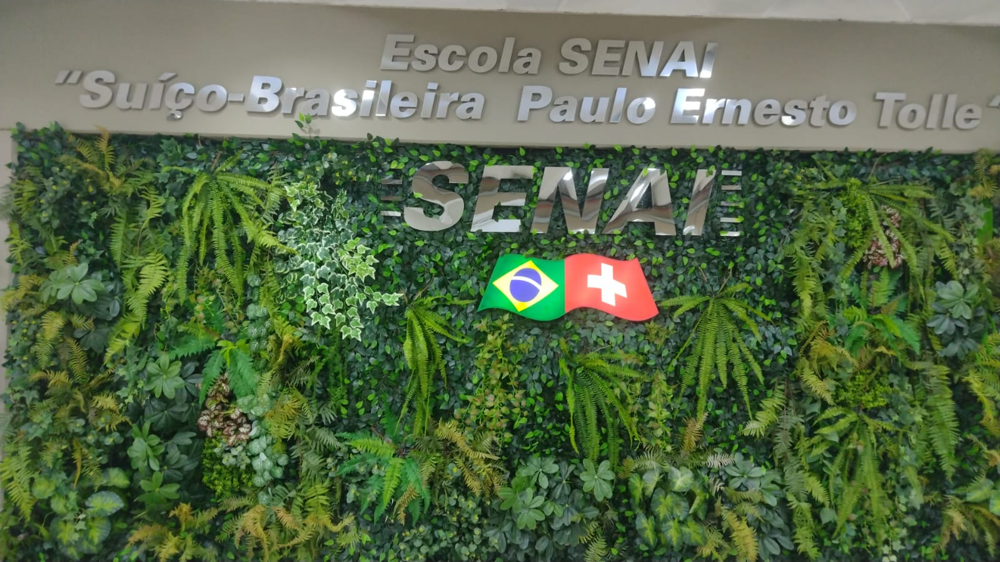

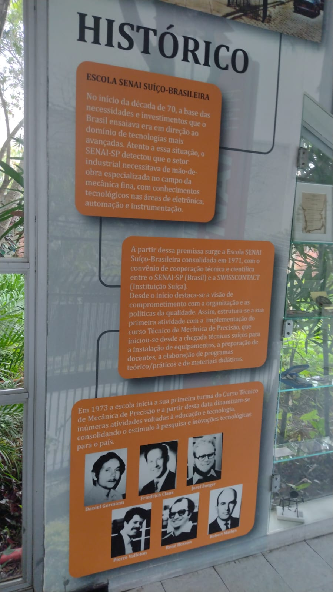
