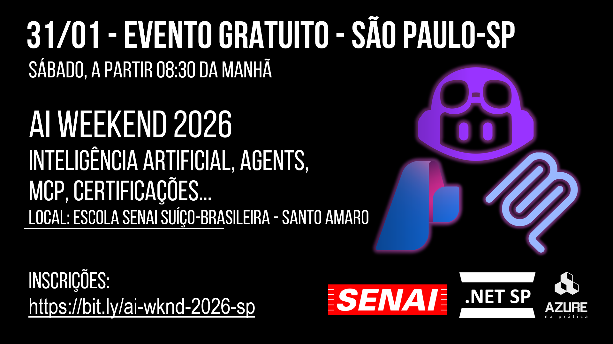

# ai-weekend-2026-01
Fotos e informações gerais sobre o evento **AI Weekend**, realizado na cidade de São Paulo-SP.

Data: **31/01/2026 (sábado)**

Organizadores:
- **Renato Groffe (Microsoft MVP, Docker Captain, Grafana Champion, APIsec U Ambassador, MTAC)**
- **Milton Camara Gomes (Microsoft MVP, MTAC)**
- **Atila Olivi (SENAI)**
- **Carlos Machel (AzureBrasil.cloud)**

Número de participantes: **45 pessoas**

---

Apresentações/talks que aconteceram durante o evento:

_# Criando Workflow com Multi-Agentes com Microsoft Agent Framework_

Palestrante: **Carlos Machel (AzureBrasil.cloud)**

Tecnologias e tópicos abordados: **Inteligência Artificial, LLMs, AI Agents, Microsoft Agent Framework, .NET, C#, Microsoft Foundry, MCP, Microsoft Azure...**

_# Produtividade no Desenvolvimento com IAs: descomplicando tarefas do dia a dia com MCP Servers_

Palestrante: **Renato Groffe (Microsoft MVP, Docker Captain, Grafana Champion, APIsec U Ambassador MTAC)**

Tecnologias e tópicos abordados: **Inteligência Artificial, LLMs, MCP, AI Agents, Containers, Visual Studio Code, GitHub Copilot, .NET, Docker, NuGet, npm, Grafana k6, Docker MCP Catalog, Azure API Management, Microsoft Agent Framework, APIsec MCP Audit, GitHub Actions, Azure DevOps, PostgreSQL...**

_# Da Documentação ao Copilot: Transformando Conhecimento Interno em Respostas Inteligentes_

Palestrante: **Milton Camara Gomes (Microsoft MVP, MTAC)**

Tecnologias e tópicos abordados: **Inteligência Artificial, LLMs, MCP, AI Agents, .NET, C#, Microsoft Azure, Microsoft Copilot 365...**

_# Painel: Desenvolvimento de Aplicações x Uso de IA -> Prós e Contras_

Participantes:
- **Renato Groffe (Microsoft MVP, Docker Captain, Grafana Champion, APIsec U Ambassador, MTAC)**
- **Milton Camara Gomes (Microsoft MVP, MTAC)**
- **Angelo Belchior (Microsoft MVP, APIsec U Ambassador, MTAC)**
- **Carlos Machel (AzureBrasil.cloud)**
- **Lucas Massena (Cloud Solutions Architect)**

Tecnologias e tópicos abordados: **Inteligência Artificial, LLMs, MCP, AI Agents, GitHub Copilot, Engenharia de Software, Arquitetura de Software, Microsoft Foundry, Boas Práticas de Desenvolvimento...**

---

Acesse este [**link**](/img/) para visualizar todas as fotos das apresentações.

Este evento foi uma parceria entre as comunidades [**.NET SP**](https://www.meetup.com/dotnet-Sao-Paulo/), [**Azure na Prática**](https://www.youtube.com/azurenapratica) e a [**Escola Senai Suíço-Brasileira Paulo Ernesto Tolle**](https://suicobrasileira.sp.senai.br/).

Formulário utilizado para inscrições: [**Sympla**](https://www.sympla.com.br/evento/ai-weekend-inteligencia-artificial-agents-mcp-gratuito-e-presencial-sao-paulo-sp/3277678)

Local: **Escola SENAI Suíço-Brasileira Paulo Ernesto Tolle - Rua Bento Branco de Andrade Filho, 379 - Santo Amaro - São Paulo/SP - CEP 04757-000**

---

